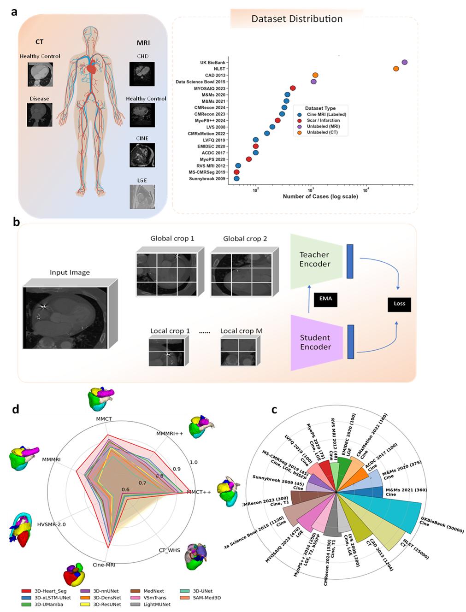

# CASTLE-FM: Towards a Multimodal Cardiac Foundation Model for Generalizable Cardiovascular Image Analysis

<p align="center">

</p>

## Overview

**CASTLE-FM (Cardiac Anatomy Self-supervised Teacher-Student Learning Foundation Model)** is a multimodal self-supervised foundation model for cardiovascular image analysis.

The model is pretrained using **three-dimensional student–teacher self-distillation** on approximately **4.7 million CT and MRI volumes from 193,500 subjects**, learning transferable anatomical and pathological representations directly from large-scale unlabelled volumetric data.

CASTLE-FM is designed to generalize across diverse cardiovascular imaging tasks while requiring substantially fewer labelled examples than conventional supervised approaches. During pretraining, cross-view representation alignment enables modality-invariant feature learning across CT and MRI, providing a unified representation suitable for multiple downstream applications.

The framework consists of two stages:

1. **Large-scale Self-supervised Pretraining**
   - 3D student–teacher self-distillation
   - Momentum teacher network
   - UxLSTM backbone
   - Cross-view representation alignment
   - Multimodal CT and MRI representation learning

2. **Downstream Adaptation**
   - Linear probing
   - Full fine-tuning
   - Segmentation
   - Classification
   - Regression
   - Disease progression prediction

---

# Supported Downstream Tasks

## Segmentation

- Whole-heart segmentation
- Cardiac chamber segmentation
- Left ventricle (LV)
- Right ventricle (RV)
- Myocardium
- Coronary arteries
- Great vessels
- Congenital heart disease segmentation
- CT and MRI segmentation

---

## Classification

- Cardiac disease diagnosis
- ACDC five-class classification
- Multi-class cardiovascular disease classification

---

## Regression

- Left ventricular ejection fraction estimation
- Right ventricular ejection fraction estimation
- Ventricular volume estimation
- Cardiac functional biomarkers

---

## Prognostic Prediction

- Five-year disease progression prediction
- Cardiovascular risk prediction

---

# Repository Structure

```text
Heart_Foundation_model/
├── nnssl/
│   └── src/nnssl/training/nnsslTrainer/masked_image_modeling/
│       ├── BaseDINOv3UxLSTMTrainer.py
│       ├── BaseDINOv3UxLSTMTrainerWithGram_701.py
│       └── BaseDINOv3UxLSTMTrainerHighRes_701.py
│
├── Segmentation/
│   ├── UxLSTMHeartTrainer.py
│   ├── nnUNet/
│   └── Scar_Segmentation_models/
│
├── classification/
│   ├── uxlstm_cvd_heads.py
│   └── finetune_cmr.py
│
├── datasets_preprocessing/
│   ├── CT_public/
│   ├── Cine_MRI_public/
│   └── ukbb_2026/
│
├── Overall_diagram.png
└── README.md
```

---

# Self-supervised Pretraining

The self-supervised framework is implemented using our **nnSSL** framework.

Repository:

https://github.com/RespectKnowledge/nnssl

Training proceeds in three stages.

## Stage 1

- DINOv3 student–teacher self-distillation
- UxLSTM encoder
- Multimodal CT and MRI pretraining

## Stage 2

- Continues from the Stage 1 teacher checkpoint
- Introduces Gram-anchor regularization

## Stage 3

- High-resolution continuation
- Improved spatial representation learning

---

# Installation

```bash
git clone --recurse-submodules https://github.com/RespectKnowledge/Heart_Foundation_model.git

cd Heart_Foundation_model

cd nnssl

pip install -e .
```

---

# Self-supervised Pretraining

```bash
nnssl_train 701 3d_fullres \
-tr BaseDINOv3UxLSTMTrainer

nnssl_train 701 3d_fullres \
-tr BaseDINOv3UxLSTMTrainerWithGram_701

nnssl_train 701 3d_fullres \
-tr BaseDINOv3UxLSTMTrainerHighRes_701
```

---

# Dataset Preparation

The repository contains preprocessing pipelines for both CT and MRI datasets.

```text
datasets_preprocessing/
```

including

- UK Biobank
- Public CT datasets
- Public cardiac MRI datasets

Each preprocessing pipeline converts raw imaging data into the format required for CASTLE-FM pretraining.

---

# Downstream Segmentation

Segmentation is built upon a customized version of **nnU-Net v2** that supports loading CASTLE-FM pretrained weights.

Example:

```bash
nnUNetv2_train <DATASET_ID> 3d_fullres <FOLD> \
-tr UxLSTMHeartTrainer
```

Evaluation metrics include

- Dice Score
- HD95

---

# Downstream Classification & Regression

Example:

Classification

```bash
python finetune_cmr.py \
--task clf \
--mode probe \
--dataset acdc
```

Regression

```bash
python finetune_cmr.py \
--task reg \
--mode finetune \
--dataset acdc
```

Supported options

| Argument | Description |
|----------|-------------|
| `--task` | `clf` or `reg` |
| `--mode` | `probe` or `finetune` |
| `--phases` | `ed`, `es`, or `both` |

---

# Datasets

CASTLE-FM has been evaluated on a broad collection of public and institutional cardiovascular imaging datasets covering CT and MRI.

Representative downstream datasets include:

- ACDC
- M&Ms
- EMIDEC
- MM-WHS
- WHS++
- HVSMR
- MyoPS
- CMRxRecon
- CMRxMotion
- UK Biobank
- ImageCAS
- ImageTAAD
- NLST
- CT-RATE
- INSPECT
- Merlin

---

# Reproducibility

This repository provides

- Complete source code
- Dataset preprocessing scripts
- Training configurations
- Fine-tuning pipelines
- Evaluation scripts

Following publication, we plan to provide

- Step-by-step Jupyter notebooks
- Complete tutorials for reproducing the full training and evaluation pipeline using publicly available CT and MRI datasets
- Pretrained weights trained exclusively on publicly available CT datasets

The complete multimodal pretrained weights cannot currently be released because part of the pretraining incorporates datasets with redistribution restrictions, including UK Biobank.

We are also working towards integrating **CASTLE-FM** into **CEMRGApp** to facilitate independent validation and broader community adoption.

---

# Citation

```bibtex
@misc{castlefm_github,
  author       = {Qayyum, Abdul and Mazher, Moona and Ugurlu, Devran and Solis Lemus, Jose Alonso and Rodero, Cristobal and Sillett, Charles and Lefebvre, Arthur and Niederer, Steven A.},
  title        = {CASTLE-FM: Towards a Multimodal Cardiac Foundation Model for Generalizable Cardiovascular Image Analysis},
  year         = {2026},
  howpublished = {\url{https://github.com/RespectKnowledge/Heart_Foundation_model}},
  note         = {GitHub repository}
}
```

If you use this repository in your research, please also cite our accompanying manuscript.

---

# License

This project is released under the license provided in `LICENSE.md`.

---

# Contact

For questions, bug reports, or collaborations, please open an issue on GitHub or contact the corresponding authors.
